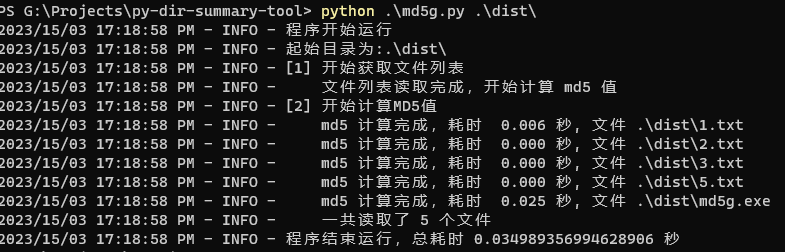
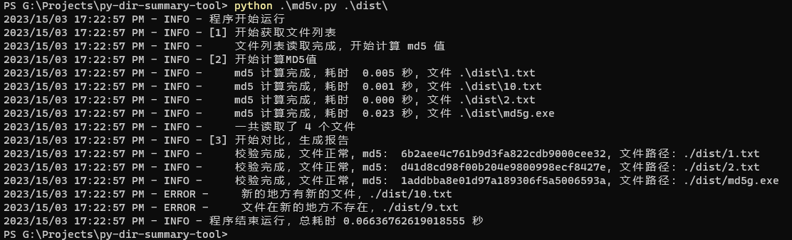

# 目录摘要生成和对比工具

这个工具是一个用Python编写的命令行工具，可以生成指定目录中文件和文件夹的概要信息报告。主要用于检测文件在传输过程中是否发生了变化。

## 克隆项目

要使用该工具，您需要先将项目克隆到本地。您可以通过以下命令将项目克隆到本地：

```bash
git clone https://github.com/rosercode/py-dir-summary-tool.git
```

## 使用方法

生成目录摘要：

```bash
python md5g.py target_dir
```



检测文件是否发生变化：

```bash
python md5.py target_dir
```



## 贡献

如果您发现任何错误或有任何建议，请随时提交问题或请求。我们欢迎并感谢所有的贡献。

## 许可证

这个工具基于MIT许可证发布，详情请参见LICENSE文件。

